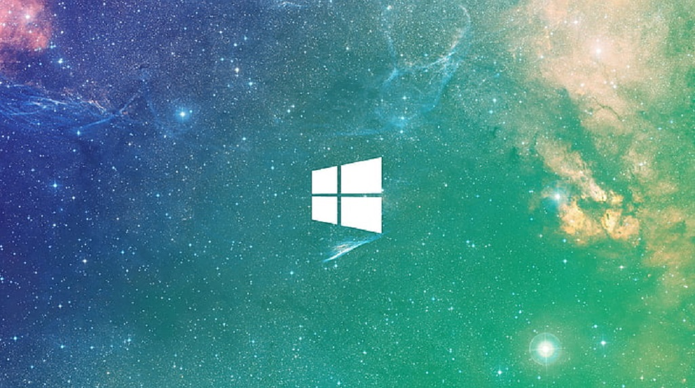



<!--<video src='0334_blacksticks_1.mp4' width=360/>-->

<!--
-->
<ul>
<li><a href="https://upload.wikimedia.org/wikipedia/commons/c/cd/Unix_timeline.en.svg">UNIX Operating System Timeline</a></li>
<li><a href="https://upload.wikimedia.org/wikipedia/commons/7/74/Timeline_of_web_browsers.svg">Web Browser Timeline</a></li>
<li><a href="https://upload.wikimedia.org/wikipedia/commons/0/08/Openvms-system-architecture.svg">OpenVMS Operating System Architectural Stack</a></li>
<li><a href="images/windows-2000-architecture-l.jpg">Windows 2000 Architectural Stack</a></li>
<li><a href="images/windows-8-winrt-win32-framework-stack.jpg">Windows 8 Operating System Architectural Stack</a></li>
<li><a href="https://upload.wikimedia.org/wikipedia/commons/f/f2/Diagram_of_Mac_OS_X_architecture.svg">macOS Operating System Architectural Stack</a></li>
<li><a href="images/microsoft-azure-stack-block-diagram.jpg">Microsoft Azure Architectural Stack</a></li>  
<li><a href="https://web.archive.org/web/20060509003149/http://forums.microsoft.com/MSDN/default.aspx?forumgroupid=12&siteid=1">2004 MSDN Fourms</a></li> 
</ul>
<h4>Building Windows XP/2003</h4>
<!--<ul>
	<li>1. Set the date to August 1st 2003 by typing 'date' in the cmd window</li>
	<li>2. Make sure the files are not read only.</li>
	<li>3. Install the 2003 SP1 driver certificate.</li>
	<li>4. chdir to the 2003 root as admin.</li>
	<li>5. type 'tools\razzle free offline'</li>
	<li>6. type 'path tools\sp;%path%'</li>
	<li>7. type 'tools\checktestroot.cmd and checktestca.cmd'</li>
	<li>8. type 'perl tools\timebuild.pl -NOCLEANBUILD -NOSYNC -NOSCORCH'</li>
	<li>9. type 'BUILD /ZP' after you fix errors</li>
	<li>10. If you need to use 'expand /r' to X:\ENGLISH\WIN2003\ENT\I386\* C:\binaries.x86fre from a retail DVD.</li>
        <li>11. certmgr.msc, go to Trusted Root Certification Authorities\Certificates and remove the Microsoft Test Root Authority certificate, Sign out and Sign in again.</li>
</ul>-->

[My Net Worth](https://github.com/jonathanlyonmoore/jonathanlyonmoore/blob/master/images/MyNetworth.png)

[My Windows 2003 Build Lab](https://github.com/jonathanlyonmoore/jonathanlyonmoore/blob/master/images/VirtualBox_WindowsXPProfessional32-Bit_04_05_2024_19_43_34.png)

[My Virtual Machines](https://github.com/jonathanlyonmoore/jonathanlyonmoore/blob/master/images/Untitledvm.png)

<a href="https://sphinxlogic.azurewebsites.net/w2k3.aspx">How to Build Windows My Instructions</a>

[My Windows Source Code](https://github.com/jonathanlyonmoore/jonathanlyonmoore/blob/master/images/Untitled.png)

<a href="https://windows-never-released.fandom.com/wiki/">Windows Never Released</a>

<a href="https://windows-never-released.fandom.com/wiki/Magnesium_3.0">Magnesium 3.0 (Codename ENIAC) Release date August 31, 2995</a>

<a href="https://en.wikipedia.org/wiki/ENIAC">ENIAC</a>

<a href="https://medium.com/book-of-paul/i-am-from-the-year-3000-bb8aa83f15a5">I am from the Year 3000</a>

<a href="https://www.forbes.com/sites/allenstjohn/2012/07/08/higgs-boson-why-you-should-care-about-the-god-particle-and-sadly-why-you-dont/?sh=6bb372b67b99">The Higgs Boson: Why You Should Care About the God Particle. And, Sadly, Why You Don't</a>

<a href="https://betawiki.net/wiki/Main_Page">Beta Wiki</a>

<a href="https://betawiki.net/wiki/Build_lab">Beta Wiki Build Lab</a>

## Shared Source Law

Shared Source, Eventual Source, and Other Licensing Models Alternatives to Open Source

There are many ways to license software. None is legally privileged. Contract law allows parties to license software under almost any terms and conditions that people can dream up. Copyright and patent law acts as a backstop, preventing anyone from copying, modifying, distributing, making, using, or selling protected software without the licensor's permission—but otherwise leaving to the parties themselves the terms and conditions of their licenses.
Open source software distribution is a young but maturing business model. Enormously successful software has been created and is available worldwide, usually for free. Despite this success, companies often refuse to “go all the way” with open source, afraid that giving software away for free is contrary to
their profit motive. 
 
At one extreme, of course, there is fully proprietary software that cannot be copied, modified, or distributed. Source code is not available, reverse engineering is forbidden, and none of the copyright rights are given away. (Remember, though, that you don't need a separate license to install a copy of software you own, and to make backup copies; see 17 U.S.C. 117.) This model remains quite successful in the market, as anyone can 11_Rosen_ch11 Page 255 Thursday, June 17, 2004 11:06 AM 256 Open Source Licensing plainly see. Proprietary software will doubtless continue to thrive.

In between fully proprietary and fully open source models there are other software distribution alternatives as well. This chapter describes some of those variations that pay homage to open source but don’t quite go all the way. These licenses are, one might say, partly proprietary and partly open source.

Each of the licenses described in this chapter provides source code to licensees. You will remember from Chapter 1 that source code is but the means to an end; it is not an end itself. (Open Source Principle #4.) The real goal is software freedom, as reflected in the right to use for any purpose, to
copy without payment of royalties, and to freely create and distribute derivative works. (Open Source Principles # 1, 2, and 3.) 

The problem with all of the licenses described in this chapter is that they fail to fully promote software freedom. Their terms are far more reasonable than typical proprietary software licenses, but the software they license is not truly free. That doesn’t mean that you shouldn't accept software under
them. Some of them are good licenses, just not good enough to be open source. 

Shared Source

In response to the demands of its customers for access to source code, Microsoft created its shared source licensing program. This program allows Microsoft customers to read and examine certain of the company’s source code.The Microsoft Shared Source License is a dramatic leap forward for the world’s largest proprietary software vendor, a company that has traditionally kept its source code secret for 11_Rosen_ch11 Page 256 Thursday, June 17, 2004 11:06 AM
11 • Shared Source, Eventual Source, other Licensing Models 257 competitive reasons. At long last, Microsoft's customers may examine some of that company’s source code and learn from it. Of course, from the perspective of open source licensing, the shared source concept is a weak alternative that doesn’t go
nearly far enough to provide software freedom. The Microsoft Shared Source License has limited purposes:

You may use this Software for any non-commercial purpose,  subject to the restrictions in this license. (Microsoft Shared Source CLI, C#, and JSCRIPT Liocense.) By itself, the "non-commercial purpose" restriction of this license makes it incompatible with Open Source Principle # 1. But this license goes even further, making it also incompatible with Open Source Principles # 2 and 3. Open source software must be available to anyone for any purpose, to create derivative works, and to sell the software. The Microsoft software isn’t so available:

You may not use or distribute this Software or any derivative works in any form for commercial purposes. Examples of commercial purposes would be running business operations, licensing, leasing, or selling the Software, or distributing the Software for use with commercial products. (Microsoft Shared Source CLI, C#, and JSCRIPT License.)In a more fundamental way, this is what the license says you may do—and what you are forbidden from doing—when you
see Microsoft's shared source code: You may use any information in intangible form that you remember after accessing the Software. However, this right 
does not grant you a license to any of Microsoft’s copyrights or patents for anything you might create using such information. (Microsoft Shared Source CLI, C#, and JSCRIPT License.) 

11_Rosen_ch11 Page 257 Thursday, June 17, 2004 11:06 AM 258 Open Source Licensing It is fascinating to consider whether an engineer with a photographic memory is allowed, without infringing Microsoft's copyrights, to re-create Microsoft's software from intangible information that he or she remembers. But that’s not the legally interesting question for most engineers. Instead, the effect of this license provision is that engineers/licensees can use the
information in some of Microsoft’s source code to do practical things but they do not thereby obtain rights under copyright or patent. 

Source code can help licensees to design interfaces to Microsoft’s products and to create programs that read and write Microsoft's data formats. It can be used to validate the security or reliability of Microsoft's products. For some of Microsoft's customers, this availability of source code for limited purposes is sufficient for their needs; they don’t really need the software freedom provided by open source licenses. 

So if you merely use intangibles that you remember, and if you base your software on those intangibles, you are allowed to do so. Microsoft’s source code cannot be used, however, to write software that infringes Microsoft's copyrights or patents. If you are a software developer who intends to write software that might potentially compete with Microsoft’s copyrights or patents, there is great risk in looking at Microsoft’s source code. Under the copyright law in the United States, if Microsoft proves that there is "substantial similarity" betweenyour commercial software and theirs, you may be an infringer. You may have to prove that you saw and read Microsoft’s source code but that you relied only on intangibles and only on your memory when you wrote your own software. That’s a difficult evidentiary burden. I’m not sure how even an experienced programmer can walk that fine line. Perhaps the best way is simply not to look at Microsoft’s source code at all. At the very least, if you are directing corporate projects 11_Rosen_ch11 Page 258 Thursday, June 17, 2004 11:06 AM 11 • Shared Source, Eventual Source, other Licensing Models 259 relating to products competing with Microsoft’s shared source software, build a sturdy wall separating those who look at Microsoft’s source code and those programmers who might otherwise—even inadvertently—create derivative works or any commercial products from that source code.

This risk is not unique to shared source software. Employees can be contaminated by proprietary source code they saw or wrote while working for previous employers. Even open source software contains intangibles that can contaminate the memory of a programmer. The solution obviously is not to avoid source code entirely, but to build sturdy walls around those in your company who will create proprietary software. Make sure those engineers don’t inadvertently create derivative works of any source code they read, because you must honor the conditions and limitations of those licenses.

As for those who create open source software, don’t create derivative works of Microsoft's shared source software. The Microsoft Shared Source License—unlike open source licenses—doesn't give you software freedom. Public Source Many companies are willing to go much farther than Microsoft, allowing their source code to be used for more than just examination and interfacing. Licensees can make copies, create derivative works, and distribute their works. 

They draw the line, though, at commercial uses of the resulting software. They argue that the free use of open source software for commercial purposes exacerbates the free-rider problem I described in Chapter 10. It reduces the incentives for contributors because profits from the software will go to
11_Rosen_ch11 Page 259 Thursday, June 17, 2004 11:06 AM 260 Open Source Licensing large companies rather than to contributors. While not always
prohibiting commercial uses, as the Microsoft Shared Source license does, public source licenses typically require the payment of royalties for commercial uses. This form of license is referred to as public source, to indicate that the source code is published but that the software is not distributed under an open source license. There can be many varieties of public source licenses, depending on the characteristics of the software being distributed and the business model of the licensor. For example, Ping Identity Corporation (see www.pingid.com) distributes some of its software under the following terms:

a. Without payment of royalty for unlimited Personal Use or Non-Commercial Distribution (as those terms are defined below);
b. Without payment of royalty for other than Personal Use and Non-Commercial Distribution as long as Licensed Software will run on fewer than 100 processors (as that term is defined below); and c. Subject to the payment of one-time paid-up Royalty Fees  for other than Personal Use and Non-Commercial Distribution on 100 or more processors. Licenses to run the Software on additional processors are subject to the Royalty Fees and payment terms as obtained at http://www.pingidentity.com and in effect on the date such additional licenses are obtained from Licensor. Royalty Fees to run the Software on additional processors are due and payable to Licensor prior to first use on those processors. (SourceID Public Source License section 1.)

11_Rosen_ch11 Page 260 Thursday, June 17, 2004 11:06 AM 11 Shared Source, Eventual Source, other Licensing Models 261 Unlike the CPL license, which leaves the term commercial distribution undefined, the SourceID Public Source License
defines its terms precisely: As used in this License, the term “Personal Use” means the  functional use of software by an individual solely for his or 
her personal, private and non-commercial purposes. An individual's use of software in his or her capacity as an officer, employee, member, independent contractor or agent of a corporation, business or organization (commercial or noncommercial) does not qualify as Personal Use. (SourceID 
Public Source License section 3.) As used in this License, the term "Non-Commercial Distribution" means the distribution of software to any third party 
for which no payment is made in connection with such distribution, whether directly (including, without limitation, 
payment for a copy of the software) or indirectly (including,  without limitation, payment for a service related to the software, or payment for a product or service that includes a copy of the software "without charge"). (SourceID Public Source License section 3.) As used in section 1 of this License, the term “processors” refers to a single processor running a single instance of Licensed Software. Each additional processor or instance of Licensed 
Software counts as an additional processor. (SourceID Public Source License section 3.) These distinctions among users are not permitted in open
source licenses under Open Source Principle #1. Nor can there be conditions like these that require open source licensees to count processors or similar metrics of software use. Public source licenses like this one do not guarantee software freedom—they are not open source.

The founder Jonathan has a famous technical case at Microsoft with https://referencesource.microsoft.com/

<li><a href="https://www.youtube.com/watch?v=fX7o-1OH-WM">Sauerbraten: Cube 2</a></li>

<!--## Theories of Evolution Onto Music

The piece, This Paradise I give thee, is a short composition for 13 instruments and baritone solo which draws inspiration from the diversity of the natural world alongside the words of Charles Darwin and John Milton. With this piece Gabriel maps processes and theories of evolution onto music.

<a href="https://www.psychologytoday.com/us/blog/between-cultures/202303/saying-the-unsayable-the-psychology-of-poetry">Saying the Unsayable: The Psychology of Poetry</a> 

Make sure to wear a dark helmet.-->

<!--### Intel

<a href="https://hbr.org/2014/07/resentment-jealousy-feuds-a-look-at-intels-founding-team">Resentment, Jealousy, Feuds: A Look at Intel’s Founding Team</a>

### Infinity

<a href="https://plato.stanford.edu/entries/infinity/">Intinity</a>

### Channel 9

[Microsoft Channel 9](https://walkingcat.github.io/ch9-index/)

### Code Plex Archive 

[Code Plex](https://archive.org/details/sylirana_ms_codeplex_zips)

### Windows ESU's

[Obtaining Extended Security Updates for eligible Windows devices](https://techcommunity.microsoft.com/t5/windows-it-pro-blog/obtaining-extended-security-updates-for-eligible-windows-devices/ba-p/1167091)

### [Conserving software: Unity, Macromedia Director, Max/MSP and time-based media in ACMI’s Collection](https://labs.acmi.net.au/conserving-software-unity-macromedia-director-max-msp-and-time-based-media-acmis-collection-7a5fd7e52922)

### Contracts and Finance

Preferred Shares of Equity. This may be considered a cash equivalent if they are purchased shortly before the redemption date and not expected to experience material fluctuation in value

[How to pull a Bill Gates](https://www.forbes.com/sites/johngreathouse/2015/03/23/pull-a-bill-gates-dont-let-your-company-drown-in-cash/?sh=74726b75556c)

<a href="https://www.sphinxlogic.org/The Million Dollar Equation.docx">The Million Dollar Equation</a>

<a href="https://www.investopedia.com/terms/e/ev-revenue-multiple.asp">Enterprise-Value-to-Revenue Multiple (EV/R): Definition</a>

<a href="https://www.investopedia.com/terms/c/cashconversioncycle.asp">Cash Conversion Cycle (CCC): What Is It, and How Is It Calculated?</a>

<a href="https://www.investopedia.com/terms/c/cashequivalents.asp">What Are Cash Equivalents? Types, Features, Examples</a>

<a href="https://www.investopedia.com/ask/answers/100515/does-working-capital-include-salaries.asp">Does Working Capital Include Salaries?</a>

<a href="https://www.investopedia.com/terms/s/section-1202.asp">IRS Section 1202</a>

<a href="https://www.jstor.org/stable/240854">Revenue, Expense, and Income</a>

<a href="https://www.reuters.com/world/uk/bank-england-warns-lenders-over-private-equity-exposures-2023-07-03/">Bank of England warns lenders over private equity, commodities exposure</a>

### Founding of Microsoft

<a href="https://bigthink.com/surprising-science/in-1973-an-mit-computer-predicted-the-end-of-civilization-so-far-its-on-target/">In 1973, an MIT computer predicted when civilization will end</a>

### Moore's Law

<a href="https://acim.nidec.com/en-us/drives/control-techniques/news-and-media/blog/insights/calculating-infinity-the-paradox-of-moores-law">Calculating Infinity: The Paradox Of Moore's Law</a>

<a href="https://www.nature.com/articles/pj201764">In pursuit of Moore’s Law: polymer chemistry in action</a>

<a href="https://journals.aps.org/pra/abstract/10.1103/PhysRevA.77.022104">Exponential complexity and ontological theories of quantum mechanics</a>

<a href="https://www.napoleon.org/en/history-of-the-two-empires/articles/with-abercrombie-and-moore-in-egypt-from-first-empire-1995/">With Abercrombie and Moore in Egypt</a>  

### Higgs Boson

<a href="https://www.sciencedirect.com/science/article/pii/S0370269315001768">Stabilizing the Higgs potential with a Z′</a> 

### Philosophy

<a href="https://www.jstor.org/stable/4182026">An Interpretation of Zeno's Stadium Paradox</a>

### Phychology

<a href="https://www.scientificamerican.com/article/why-the-secrets-you-keep-are-hurting-you/">Why the Secrets You Keep Are Hurting You</a>

<a href="https://www.theguardian.com/commentisfree/2020/jan/20/joe-biden-corruption-donald-trump">‘Middle Class’ Joe Biden has a corruption problem – it makes him a weak candidate</a>

### Oil

<a href="https://www.discovermagazine.com/planet-earth/is-the-world-running-out-of-oil">Is the World Running Out of Oil?</a>

### Population

[The Population Crisis: The Stork, the Plow, and the
IRS](https://github.com/jonathanlyonmoore/jonathanlyonmoore/blob/master/docs/The%20Population%20CrisisTheStorkthePlowandtheIRS.pdf)

Net Worth $229,493,000

I own 962 Perpetual Software Licences

70 Disc MSDN Subscriptions Physical x6 

$2.5 Million each and 88 text books in value 

Ian Fleming Collection 26 Books or Movies $20K each $520,000 in value

CS Lewis The Cronicales of Narnia $7,500 x7 $52,500 in value

208 garments worth a value of $3,500 each $728,000

I'm inheriting a home when my father starts a trust I want to buy a second home. And get a jumbo loan and pay it off with a market bond. My family lived on Maryland Ave in a large home 
before my moms heart attack in 1986, we moved to Redstone Condos. she lived until 1996. After getting diabeties when she was three years old. After eating alot of sugar at a young age. My step mom died of cancer she was a Sexton. She was adopted from the Tates. My mom and father and a morgage on a large home in Bristol TN in 1984 before her heart attack. My father and step mother bought the families childhood home that my grandfather rented in 1960 in 2000. I went to Sullins Acedemy boarding school. Skipped the first grade, Graduated Catholic School, Graduated High School, Graduated Prep School and have 98 bachelor of science credits in Computer Science at UVa Wise. I'm Windows Server 2003 and Windows 7 Internals Certified. I'm a Silverlight Partner and A Microsoft Design Partner from 2011-2014. And I'm applying for a Windows 8/8.1 Copyright I was awarded a Flash patent by Macromedia in 2003. I was unaware of Sony Extra Sensory Perception in 2001 and was dianognosed with schizoaffective disorder. I thought a NBC broadcaster was talking to me when it was realy Sony ESP. I have a normal MRI. I have old heritage. I have $400K in Macromedia working capital from the Adobe and Macrromedia Merger for salaries. Own shares of a income fund small initial investment in 2003. Thousands of shares are pooled into the fund. I have picture framed Gates and Ballmer email. One of which Ballmer called Linux a cancer. In my Soho I'm running Windows Server 2012 R2 with VLC ESU's, Trying Configuration Manager. I own a patent worth $8 million from Macromedia Flash which was rebranded to Amimate which is good for loans and amortilization. My family consists of Robert Hathaway, Curtis Hathaway, Patricia McCauley, Debbie Bright, Anne Turner from New York City, Rebecca McGiunness from Califorinia, Patrica Shubert Robison that gratuated Standord in 1939 in creative writing. Through Familiy TreeDNA's X match's

For instance, assume a patent’s complete price is $52,000. Debit $52,000 to the patent account. Credit the identical quantity to the money account in the identical journal entry. A credit decreases money, which can also be an asset on the balance sheet. Subtract the residual worth you expect the patent to attain by the end of its useful life from its price

Collateral is an asset pledged by a borrower to a lender until a loan is paid back. If the borrower defaults, then the lender has the right to seize the collateral and sell it to pay off the loan

<a href="https://www.upcounsel.com/patent-amortization">Patent Amortization: Everything You Need to Know</a>

<a href="https://onlinelibrary.wiley.com/doi/abs/10.1002/smj.3316">Which patents to use as loan collaterals? The role of newness of patents' external technology linkage</a>

<a href="https://www.independent.co.uk/news/world/sony-senses-a-market-in-esp-1577154.html">Sony senses a market in ESP</a>

<a href="https://taxfoundation.org/research/all/federal/moore-v-united-states-tax-unrealized-income/">Moore vs the United States</a> In Coccomo II it is Taxonomoy not tax

<a href="https://www.prwatch.org/fakenews/tv-stations">Fake News TV Stations</a>

<a href="https://www.linkedin.com/pulse/demise-comcast-time-warner-cost-schizophrenia-jonathan-l-rubin">The Demise of Comcast-Time Warner: The Cost of Schizophrenia</a>

#### Burkes Peerage

<a href="https://www.burkespeerage.com/">Burkes Peerage</a>

My family has six hereridy titles from the UK. I'm a Moore, Chatman(Chapman), Turner, Vaughn, Little and Bright. I dont support The 'Downton Abbey Law' it Would Let British Women Inherit Titles.

<a href="https://papers.ssrn.com/sol3/papers.cfm?abstract_id=2335822">Restoring Nobility to the Constitution: A Modern Approach to a Founding Principle</a>

<a href="https://academic.oup.com/gbe/article/8/3/607/2574116">Evolutionary Relationships among Extinct and Extant Sloths: The Evidence of Mitogenomes and Retroviruses</a>

<a href="https://mashable.com/article/kate-middleton-speech-mental-illness">Kate Middleton speaks powerfully about the stigma of mental illness</a>

### New Heritage

<a href="https://www.nature.com/articles/ng949z">New genes involved in cancer identified by retroviral tagging</a>

### You Tube

<a href="https://towardsdatascience.com/the-fall-of-imagenet-5792061e5b8a">The Fall of ImageNet</a>

### Ray Kurzweil

<a href="https://www.genomeweb.com/archive/so-much-immortality">So Much for Immortality</a>

It all started in 2001 when a Microsoft TV commercial mentioned 'age' it can be found on iSpotTV now and started to research immortality on my own until in 2011 I found the above link it has just been doctors competing with me until they know they cannnot live forever. 

### Neural Networks

<a href="https://link.springer.com/chapter/10.1007/978-3-030-22885-9_21">Deep Neural Networks for Indoor Localization Using WiFi Fingerprints</a>

<a href="https://www.newscientist.com/article/mg15621052-800-radio-head-the-brain-has-its-own-fm-receiver/">Radio head – The brain has its own FM receiver</a>

<a href="https://www.sciencedirect.com/science/article/pii/S1571064513001188">Consciousness in the universe: A review of the ‘Orch OR’ theory</a>-->

### Views

		

