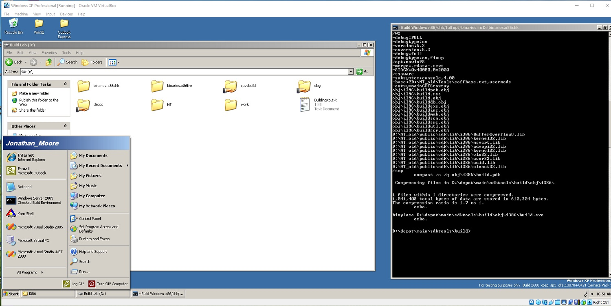
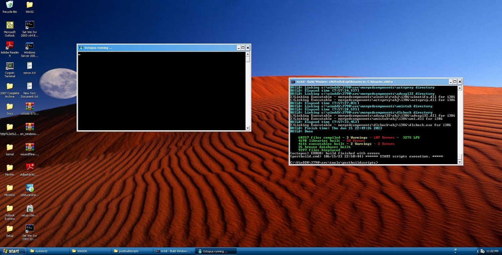



<!--<ul>
<li><a href="https://upload.wikimedia.org/wikipedia/commons/c/cd/Unix_timeline.en.svg">UNIX Operating System Timeline</a></li>
<li><a href="https://upload.wikimedia.org/wikipedia/commons/7/74/Timeline_of_web_browsers.svg">Web Browser Timeline</a></li>
<li><a href="https://upload.wikimedia.org/wikipedia/commons/0/08/Openvms-system-architecture.svg">OpenVMS Operating System Architectural Stack</a></li>
<li><a href="images/windows-2000-architecture-l.jpg">Windows 2000 Architectural Stack</a></li>
<li><a href="images/windows-8-winrt-win32-framework-stack.jpg">Windows 8 Operating System Architectural Stack</a></li>
<li><a href="https://upload.wikimedia.org/wikipedia/commons/f/f2/Diagram_of_Mac_OS_X_architecture.svg">macOS Operating System Architectural Stack</a></li>
<li><a href="images/microsoft-azure-stack-block-diagram.jpg">Microsoft Azure Architectural Stack</a></li>  
<li><a href="https://web.archive.org/web/20060509003149/http://forums.microsoft.com/MSDN/default.aspx?forumgroupid=12&siteid=1">2004 MSDN Fourms</a></li> 
<li><a href="https://web.archive.org/web/20010403224927/http://research.microsoft.com/">University Programs</a></li>
</ul>-->
<!--<ul>
	<li>1. Set the date to August 1st 2003 by typing 'date' in the cmd window</li>
	<li>2. Make sure the files are not read only.</li>
	<li>3. Install the 2003 SP1 driver certificate.</li>
	<li>4. chdir to the 2003 root as admin.</li>
	<li>5. type 'tools\razzle free offline'</li>
	<li>6. type 'path tools\sp;%path%'</li>
	<li>7. type 'tools\checktestroot.cmd and checktestca.cmd'</li>
	<li>8. type 'perl tools\timebuild.pl -NOCLEANBUILD -NOSYNC -NOSCORCH'</li>
	<li>9. type 'BUILD /ZP' after you fix errors</li>
	<li>10. If you need to use 'expand /r' to X:\ENGLISH\WIN2003\ENT\I386\* C:\binaries.x86fre from a retail DVD.</li>
        <li>11. certmgr.msc, go to Trusted Root Certification Authorities\Certificates and remove the Microsoft Test Root Authority certificate, Sign out and Sign in again.</li>
</ul>-->

### Curriculum Vitae

3 Saved Jobs at Microsoft Careers

<a href="https://betawiki.net/wiki/Build_lab">Windows Build Lab</a>

<a href="https://news.microsoft.com/2002/02/21/microsoft-announces-major-expansion-of-shared-source-initiativeproviding-source-code-to-systems-integrators/">Microsoft Announces Major Expansion of Shared Source Initiative,Providing Source Code to Systems Integrators</a>

[System Integrator Contract](https://github.com/jonathanchapmanmoore/jonathanchapmanmoore/blob/master/images/contract.jpg)

[Bill Gates Forrester Email to me in 2005](https://github.com/jonathanchapmanmoore/jonathanchapmanmoore/blob/master/images/gates.jpg)

<a href="https://www.forrester.com/blogs/determining-the-value-of-a-perpetual-license/">Determining the Value of a Perpetual License</a>

<a href="https://www.investopedia.com/terms/e/ev-revenue-multiple.asp">Enterprise-Value-to-Revenue Multiple (EV/R): Definition</a>

<a href="https://www.investopedia.com/terms/c/cashconversioncycle.asp">Cash Conversion Cycle (CCC): What Is It, and How Is It Calculated?</a>

How do you get you get your million in cash doctor? "take care of" a high functioning schizophrenic.

<a href="https://www.sphinxlogic.org/Jonathan Chapman Moore FRSA.docx">Curriculum Vitae</a>

### Jonathan Chapman Moore

Net Worth $229,493,000

I own 962 Perpetual Software Licences

70 Disc MSDN Subscriptions Physical x6 

$2.5 Million each and 88 text books in value 

Ian Fleming Collection 26 Books or Movies $20K each $520,000 in value

CS Lewis The Cronicales of Narnia $7,500 x7 $52,500 in value

208 garments worth a value of $3,500 each $728,000

[My Credit Score](https://github.com/jonathanchapmanmoore/jonathanchapmanmoore/blob/master/images/credit.jpg)

<a href="https://www.investopedia.com/how-to-refinance-a-second-home-7487004">How to Refinance a Second Home</a>

I'm inheriting a home when my father starts a trust I want to buy a second home. And get a jumbo loan and pay it off with a market bond. My family 
had 2 large homes before my moms heart attack in 1986, she lived until 1996. I was unaware of Sony Extra Sensory Perception in 2001 and was dianognosed
with schizoaffective disorder. I thought a NBC broadcaster was talking to me when it was realy Sony ESP.

<a href="https://www.independent.co.uk/news/world/sony-senses-a-market-in-esp-1577154.html">Sony senses a market in ESP</a>

<a href="https://www.burkespeerage.com/">Burkes Peerage</a>

My family has six hereridy titles from the UK. I'm a Moore, Chatman(Chapman), Turner, Vaughn, Little and Bright.

<a href="https://www.genomeweb.com/archive/so-much-immortality">So Much for Immortality</a>

It all started in 2001 when a Microsoft TV commermial mentioned 'age' it can be found on iSpotTV now and stareted to research immortality on my own until in 2011 I found the above link it has just been doctors competing with me until they know thaey cannnot live forever. 

<a href="https://bigthink.com/surprising-science/in-1973-an-mit-computer-predicted-the-end-of-civilization-so-far-its-on-target/">In 1973, an MIT computer predicted when civilization will end</a>

<a href="https://www.linkedin.com/pulse/demise-comcast-time-warner-cost-schizophrenia-jonathan-l-rubin">The Demise of Comcast-Time Warner: The Cost of Schizophrenia</a>

<a href="https://www.cnbc.com/2018/04/03/the-real-danger-in-sinclair-broadcasts-fake-news-scandal.html">The real danger in Sinclair Broadcast’s ‘fake news’ scandal</a>

<a href="https://www.nature.com/articles/pj201764">In pursuit of Moore’s Law: polymer chemistry in action</a>

<a href="https://journals.aps.org/pra/abstract/10.1103/PhysRevA.77.022104">Exponential complexity and ontological theories of quantum mechanics</a>

<a href="https://www.microsoft.com/en-us/research/project/language-integrated-quantum-operations-liqui/">Language-Integrated Quantum Operations: LIQUi|</a> 

<a href="https://windows-never-released.fandom.com/wiki/Windows_Never_Released_Wiki">Windows Never Released Wiki</a> 

<a href="https://www.microsoft.com/en-us/sharedsource/debugging.aspx">Debug with Code Center Premium Source</a>

<a href="https://www.instagram.com/jonathanchapmanmoore/">Instrgram</a>

<a href="https://www.sphinxlogic.org/The Million Dollar Equation.docx">The Million Dollar Equation</a>

<a href="https://www.16personalities.com/profiles/2ebeedfa55fbe">My 16 Personalties Profile</a>

<a href="https://www.thersa.org/fellowship/find-a-fellow/profile/139174">My Royal Soceity of the Arts Fellowship</a>

<a href="https://www.truity.com/infographic/16-personality-types-animals">Animal Personalites</a>

<a href="https://www.codeproject.com/script/Membership/View.aspx?mid=527156">My Code Project Profesional Profile</a>

<a href="https://github.com/jonathanchapmanmoore/My-Mensa-Tests">My Mensa Tests</a>

<a href="https://www.jstor.org/stable/4182026">An Interpretation of Zeno's Stadium Paradox</a>

<a href="https://www.jstor.org/stable/25071523">Competition in Consumption as Viewed by Jewish Law</a>

<a href="https://hbr.org/2013/05/autisms-competitive-advantage">Autism’s Competitive Advantage, and Challenge, in the Workplace</a>

<a href="https://www.newscientist.com/article/mg15621052-800-radio-head-the-brain-has-its-own-fm-receiver/">Radio head – The brain has its own FM receiver</a>

<a href="https://academic.oup.com/gbe/article/8/3/607/2574116">Evolutionary Relationships among Extinct and Extant Sloths: The Evidence of Mitogenomes and Retroviruses</a>

<a href="https://www.nature.com/articles/ng949z">New genes involved in cancer identified by retroviral tagging</a>

<a href="https://papers.ssrn.com/sol3/papers.cfm?abstract_id=2335822">Restoring Nobility to the Constitution: A Modern Approach to a Founding Principle</a>

<a href="https://www.youtube.com/watch?v=hWSgH8ytLJI">Paul Allen's Yacht</a>

<a href="https://github.com/jonathanchapmanmoore/UWA">My University of Washington Gift</a>

[Ecology and the Jewish Spirit where Nature and the sacred meet](https://github.com/jonathanchapmanmoore/jonathanchapmanmoore/blob/master/images/jewish.jpg)

<!--<a href="https://www.investopedia.com/terms/c/cashconversioncycle.asp">Cash Conversion Cycle</a>
<a href="https://www.investopedia.com/terms/s/section-1202.asp">IRS Section 1202</a>
<a href="https://github.com/jonathanchapmanmoore/jonathanchapmanmoore/blob/master/images/Untitled.png">Traditional IRA account</a>-->

### Views

		

