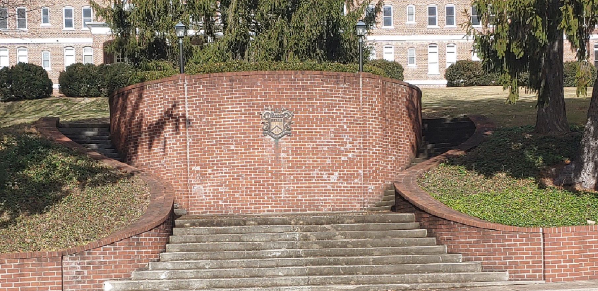

### Hi there

* First school was The English Sullins Academy in 1984 pictured below. UVa Alumni with a C in Operating Systems Theroy, Data Structures and Algorithms And C# and a B in Digital Art with Adobe CS6,
	* Accounting and Geology and C/C++. Former MSDN Student Ambassador, And Visual Studio Industry Partner
Recived a MSFT Tendor offer in 2006 and pooled together 1.5% stake in Microsoft
Still hold a 20% per Federal source code policy or private equity in MSFT.
Windows is 9% contact your Ivy League Proffessor or Dept of Education.
I still have my MSDN Acedemic Alliance files. Shipped Fluent Control Ribbon 2.0, World Wide Telescope & WPF Toolkit 3.5 & 4.0 
through Codeplex and Component Source. In 2010 with Xceed & Janus Systems & Software. 
With the Ribbon Control Library Suite. On Teams. Through their reseller program. 
Shipping the .NET Core 2.1.5, 3.13 and Roslyn and portions of Visual Studio 2019 through the .NET Foundation 
and upstream and downstream pull requests. And joined the Windows App Developer program in 2019. And 
working on a patent protected framework and C# Operating System. And built the University of Washington's Spin OS on Redhat 4.2
I've a 2019 Microsoft Bizspark Graduate with graduation email from Microsoft's Midori Lawler, Free Microsoft Tech Support and A Changeset of Verve. Favorite Songs are
Pearl Jam's Black, Oceans, Spin the Black Cirlce, In My Tree, Arms Aloft, Public Image, Rearviewmirror, Blood, Dissident, Leash and Betterman. 

  
[<b>Blog</b>](https://jdm7dvcsmath.blogspot.com/)
 
[<b>Code Project Moderator</b>](https://www.codeproject.com/script/Membership/View.aspx?mid=527156)
 
[<b>Deviant Art</b>](https://www.deviantart.com/jdm7dv)
 
 

  
